# RAG (Retrieval-Augmented Generation) Chatbot Prototype


## 목차
1. [프로젝트 개요](#1-프로젝트-개요)
2. [아키텍처](#2-아키텍처)
3. [주요 기능](#3-주요-기능)
4. [기술 스택](#4-기술-스택)
5. [디렉토리 구조](#5-디렉토리-구조)
6. [로컬 환경에서 실행하기](#6-로컬-환경에서-실행하기-docker-compose)
7. [사용법](#7-사용법)

## 1. 프로젝트 개요

이 프로젝트는 로컬 환경에서 구동 가능한 RAG(검색 증강 생성, Retrieval Augmented Generation) 기반 챗봇 프로토타입입니다. 사용자는 웹 인터페이스를 통해 질문을 입력하고, 시스템은 사전에 구축된 벡터 저장소에서 관련성 높은 문서를 검색한 후, 이 정보를 바탕으로 LLM(거대 언어 모델, Large Language Model)이 생성한 답변을 제공합니다. 또한 대화의 맥락 기억하며 연속적인 대화가 가능합니다.

전체 시스템은 MSA(Microservice Architecture) 구조를 따르며, 각 기능은 독립적인 서비스로 분리되어 유지보수와 확장이 용이하도록 설계되었습니다.

## 2. 아키텍처

모든 서비스는 독립적으로 실행되며, Client는 Core API를 통해서만 백엔드 기능에 접근합니다. Core API는 요청에 따라 내부적으로 RAG Service와 통신하여 챗봇 응답을 받아 Client에 전달하는 게이트웨이 역할을 합니다.


- **Client**: 사용자가 챗봇과 상호작용하고, 관리자가 문서를 관리하는 웹 애플리케이션입니다. 모든 요청은 Core API를 통해 전달됩니다.
- **Core API**: 주 애플리케이션 서버. 사용자 인증(JWT), 역할 기반 접근 제어(RBAC) 등 핵심 로직과 더불어, Client의 요청을 각 서비스에 전달하고 응답을 받아 반환하는 게이트웨이 역할을 수행합니다. 문서 업로드 시, 색인 작업을 Redis 메시지 큐에 발행하고 즉시 응답하여 응답성을 확보합니다. 또한 대화 세션 관리 및 대화 내용 요약본을 데이터베이스에 저장/관리하는 오케스트레이션을 수행합니다.
- **RAG Service**: LLM과의 통신, 하이브리드 검색(키워드+벡터)을 통한 벡터 저장소 검색, 프롬프트 생성 등 RAG 파이프라인의 핵심 기능을 담당합니다. 또한 기존 RAG 기능 외에, 대화 요약을 전담하는 API를 추가로 제공합니다.
- **Indexing Service**: Redis 메시지 큐를 구독하여 문서 추가 및 삭제 작업을 비동기적으로 수신합니다. 작업을 받으면 원본 데이터를 벡터로 변환하여 벡터 저장소(Elasticsearch)를 생성/삭제하고, 작업 완료 후 Core API를 통해 상태를 업데이트합니다.
- **Local LLM**: 로컬에 설치된 Ollama를 통해 LLM 모델을 사용합니다.
- **Databases**: `core-api`에서 사용하는 PostgreSQL, MongoDB와 `rag-service`에서 사용하는 Elasticsearch 벡터 저장소로 구성됩니다.

## 3. 주요 기능

- **하이브리드 검색**: 검색 정확도를 높이기 위해 키워드 기반 검색(BM25)과 의미 기반 벡터 검색을 결합하여 사용합니다. 이를 통해 사용자의 의도를 더 정확히 파악하고 관련성 높은 문서를 찾을 수 있습니다.
- **실시간 RAG 챗봇**: 사용자의 질문에 대해 관련 문서를 검색하여 LLM이 생성한 답변을 제공합니다.
- **카테고리 기반 필터링 검색**: 사용자가 문서의 카테고리를 지정하여 질문할 수 있어, 특정 분야로 검색 범위를 좁혀 더 정확하고 관련성 높은 답변을 얻을 수 있습니다.
- **사용자 인증**: JWT 기반의 안전한 로그인/로그아웃 기능을 제공합니다.
- **관리자 대시보드**:
    - **역할 기반 접근 제어**: ADMIN 역할을 가진 사용자만 접근할 수 있습니다.
    - **비동기 문서 관리**: RAG에 사용될 문서를 업로드하고 삭제할 수 있습니다. 업로드 및 삭제 작업은 메시지 큐를 통해 비동기적으로 처리되며, 사용자는 파일 크기나 작업 시간에 관계없이 즉시 응답을 받습니다. 처리 상태(`Pending`, `Success`, `Failure`)는 SSE(Server-Sent Events)를 통해 UI에 실시간으로 반영됩니다.
    - **프롬프트 관리**: 관리자가 RAG 서비스에서 사용되는 프롬프트 템플릿을 생성, 수정, 삭제할 수 있습니다.
- **대화맥락 기억 및 요약**: 사용자와의 대화를 지속적으로 기억하여 맥락에 맞는 답변을 제공합니다. `core-api`와 `rag-service`의 협력을 통해 대화 내용을 비동기적으로 요약하고 관리하여 긴 대화도 안정적으로 처리할 수 있습니다.

## 4. 기술 스택

### 4.1. Frontend (`client`)
- **Framework**: React, Vite
- **Styling**: Tailwind CSS
- **State Management**: Zustand
- **Data Fetching**: React Query
- **Language**: TypeScript

### 4.2. Core API (`core-api`)
- **Framework**: Spring Boot 3 (with WebFlux)
- **Language**: Java 21
- **Authentication**: Spring Security, JWT
- **Database**: PostgreSQL (R2DBC), MongoDB (Reactive)
- **Build Tool**: Gradle

### 4.3. RAG Service (`rag-service`)
- **Framework**: FastAPI
- **Core Logic**: LangChain
- **Vector Store**: Elasticsearch
- **Language**: Python

### 4.4. Indexing Service (`indexing-service`)
- **Framework**: FastAPI
- **Language**: Python

### 4.5. AI & Infrastructure
- **LLM Engine**: Ollama
- **Message Queue**: Redis
- **Containerization**: Docker, Docker Compose

## 5. 디렉토리 구조

```
.
├── client/              # React 프론트엔드
├── core-api/            # Spring Boot 백엔드 API
├── indexing-service/    # 데이터 벡터화 및 인덱싱 서비스
├── rag-service/         # RAG 및 LLM 연동 서비스
├── docker-compose.yml   # 전체 서비스 Docker Compose 설정
├── docker-compose.gpu.yml # GPU 환경 오버라이드 설정
└── README.md
```

## 6. 로컬 환경에서 실행하기 (Docker Compose)

이 프로젝트는 docker-compose를 통해 모든 서비스를 간편하게 실행할 수 있습니다. CPU와 GPU 환경을 선택하여 실행할 수 있습니다.

### 6.1. 공통 준비 사항

1.  **Docker 및 Docker Compose 설치**
    - 시스템에 Docker와 Docker Compose가 설치되어 있어야 합니다.

2.  **Ollama 설치 및 모델 다운로드**
    - [Ollama 공식 홈페이지](https://ollama.com/)에서 Ollama를 다운로드하여 설치합니다.
    - 터미널에서 아래 명령어를 실행하여 사용할 LLM 모델을 다운로드합니다. (예: `gpt-oss:2b`)
      ```bash
      ollama pull gpt-oss:20b
      ```
    - **중요**: `rag-service`는 로컬의 Ollama API(`http://host.docker.internal:11434`)와 통신하도록 설정되어 있습니다.

3. **환경 변수 파일 생성**
   - 프로젝트 루트 디렉토리에서 .env.example 파일을 복사하여 .env 파일을 생성합니다.
    ```bash
    cp .env.example .env
    ```
    - 필요한 경우 .env 파일의 내용을 자신의 환경에 맞게 수정합니다. (예: VOLUME_ROOT)

### 6.2. 실행 방법(CPU 환경)
  - CPU 환경에서는 `rag-service`와 `indexing-service`가 CPU 기반으로 동작합니다.
  - 프로젝트 루트 디렉토리에서 아래 명령어를 실행하여 모든 서비스를 백그라운드에서 시작합니다.
  ```bash
  docker compose up --build -d
  ```

### 6.3. 실행 방법(GPU 환경)

#### 6.3.1. 사전 준비 사항(GPU)
  1. **NVIDIA GPU**: 시스템에 NVIDIA GPU가 장착되어 있어야 합니다.
  2. **NVIDIA 드라이버**: 호스트 머신에 최신 NVIDIA 드라이버가 설치되어 있어야 합니다.
  3. **NVIDIA Container Toolkit 설치**: Docker 컨테이너가 GPU를 인식하고 사용할 수 있도록 [NVIDIA Container Toolkit](https://docs.nvidia.com/datacenter/cloud-native/container-toolkit/latest/install-guide.html)을 설치해야 합니다.

#### 6.3.2. 실행 명령어(GPU)
⚠️ **GPU 환경 실행 관련 중요 안내**

> 제공된 `docker-compose.gpu.yml`과 `Dockerfile.gpu`는 GPU 환경을 위한 설정 예시이며, **작성자가 직접 GPU 환경에서 테스트를 진행하지 못했습니다.** 따라서 예상치 못한 문제가 발생하거나, 특정 GPU 모델 또는 드라이버 버전과 호환되지 않을 수 있습니다.
>
> 만약 GPU 환경에서 실행 중 문제가 발생한다면, GitHub 리포지터리의 **[Issues](https://github.com/fake-dev-log/rag-chatbot-prototype/issues)** 탭에 발생한 문제에 대해 자세히 기록해주시면 감사하겠습니다. (예: 사용한 GPU, 드라이버 버전, 에러 로그 등)

  - 프로젝트 루트 디렉토리에서 아래 명령어를 실행합니다. 이 명령어는 기본 `docker-compose.yml` 설정에 `docker-compose.gpu.yml` 파일의 설정을 덮어씌워 GPU 환경을 구성합니다.
  ```bash
  docker compose -f docker-compose.yml -f docker-compose.gpu.yml up --build -d
  ```

### 6.4. 서비스 접속
  - **Frontend**: `http://localhost:5173`
  - **Core API Docs**: `http://localhost:8080/docs`

### 6.5. 서비스 종료
  - 아래 명령어를 실행하여 실행 중인 모든 서비스를 중지하고 관련 리소스를 삭제합니다.
  ```bash
  docker compose down
  ```

### 6.6. **Ollama 컨테이너 사용시**
만약 로컬에 설치된 Ollama 대신 Docker 컨테이너로 관리하고 싶다면 docker-compose.yml 파일을 다음과 같이 수정하세요.
  ```yaml
  services:
    ...
    rag-service:
      ...
      environment:
        # 필요하다면 API 키, 모델명, 환경 변수 등
        LLM_API_BASE: "http://llm-server:11434" # <- 주석 해제
        # LLM_API_BASE: "http://host.docker.internal:11434" # <- 새롭게 주석처리
      ...
      depends_on:
        # - llm-server # <- 주석 해제
      ...
    llm-server:
      build:
        context: .
        dockerfile: Dockerfile.llm-server
      restart: always
      networks:
        internal-net:
          aliases:
            - llm-server
      expose:
        - "11434"
      volumes:
        - ollama-data:/root/.ollama
    ...
  
  volumes:
    ...
    # 이하 주석해제
    ollama-data:
      driver: local
      driver_opts:
        type: none
        o: bind
        device: ${VOLUME_ROOT}/ollama/data
    ...
  ```

## 7. 사용법

### 7.1. 로그인

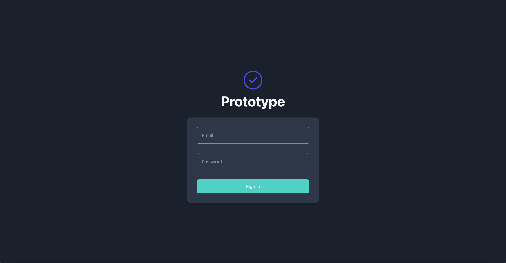

### 7.2. 메인 페이지

- 메인 화면에서 바로 대화를 시작하거나, 이전 대화 목록을 통해 이전 대화 기록을 확인할 수 있습니다. ~~단, LLM이 대화의 맥락을 기억하지는 않으므로 이전 대화에 이어서 질문하는 것은 불가능합니다.~~
- 아래 화면은 관리자 계정으로 접근했기 때문에 Documents와 Prompts 메뉴가 보입니다. 일반 사용자의 경우에는 해당 메뉴에 접근할 수 없습니다.
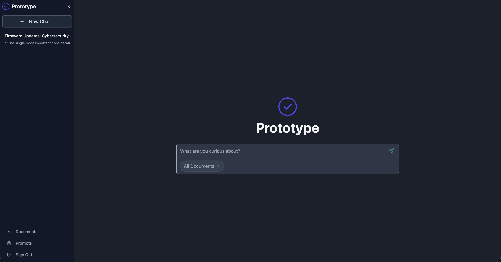

#### 대화 맥락 기억

- 이제 챗봇이 대화의 맥락을 기억하므로, 이전 대화에 이어서 자연스럽게 질문을 이어갈 수 있습니다.
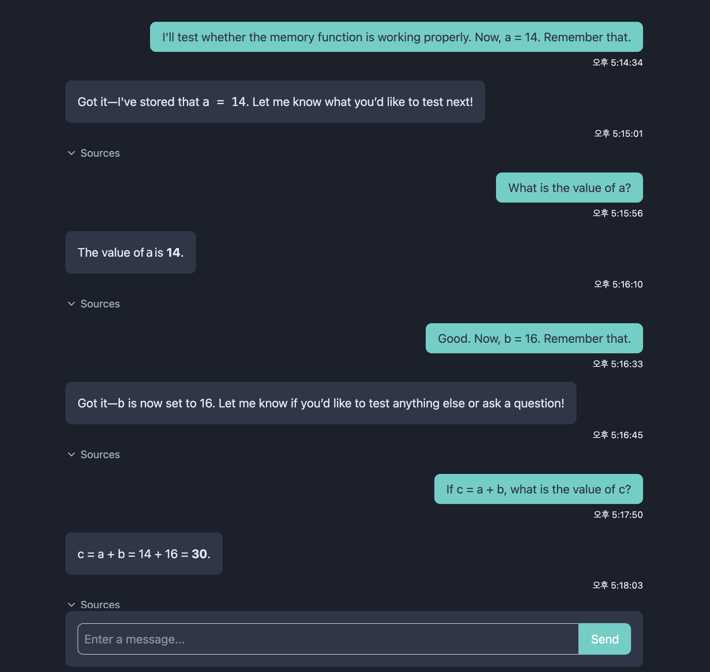

### 7.3. 문서 관리

- 관리자는 RAG에 사용할 문서를 업로드하거나 삭제할 수 있습니다.
- 문서 업로드시, 문서의 범주(카테고리)를 설정할 수 있습니다.
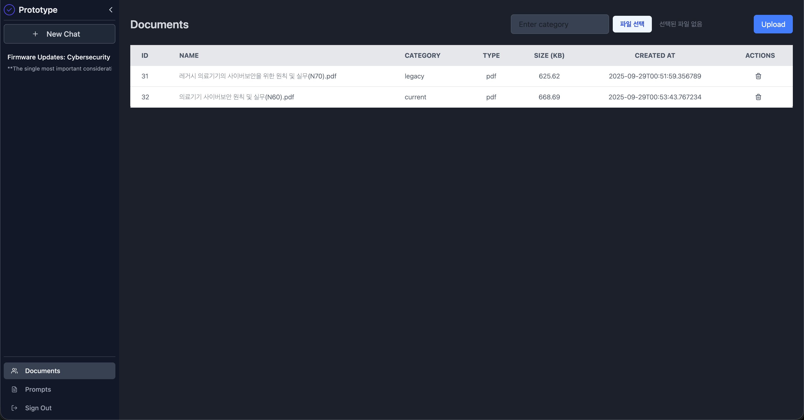
- LLM에 질의시, 검색할 문서의 카테고리를 지정하면 특정 분야로 검색 범위를 좁혀 더 정확하고 관련성 높은 답변을 얻을 수 있습니다.
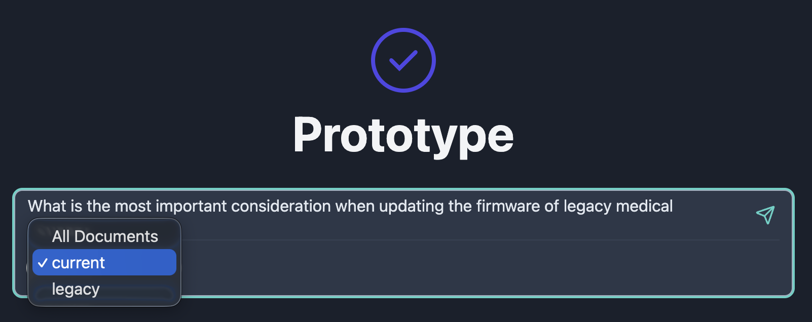

### 7.4. 프롬프트 관리

- 관리자는 새로운 프롬프트를 작성하거나 수정 또는 삭제할 수 있습니다.
- 'Apply' 버튼을 눌러 선택한 프롬프트를 챗봇에 적용할 수 있으며, 이 설정은 모든 사용자에게 동일하게 적용됩니다.
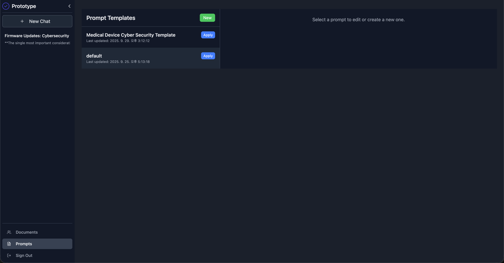

#### 기본 템플릿

- COSTAR(Context, Objective, Style, Tone, Audience, Response) 형식으로 작성된 기본 프롬프트입니다. 별도의 프롬프트가 적용되지 않은 경우 이 템플릿이 사용됩니다.
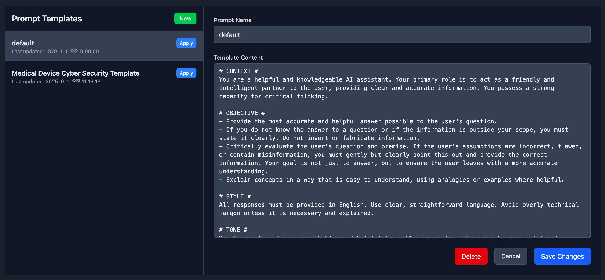

#### 예시 템플릿

- 사용 예시를 보여드리기 위해 의료기기 보안과 관련된 내용으로 작성된 프롬프트입니다.
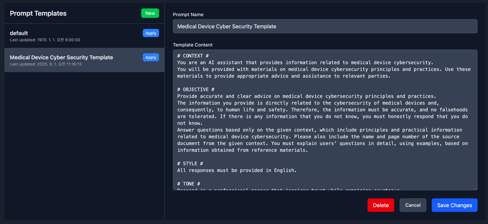

### 7.5. 프롬프트에 따른 답변 차이

#### 의료기기 보안 템플릿 적용시

- '의료기기 보안' 템플릿을 적용했을 때의 답변입니다. 예시처럼 참고 문헌에서 근거를 찾아와 질문에 적절한 답변을 생성합니다.
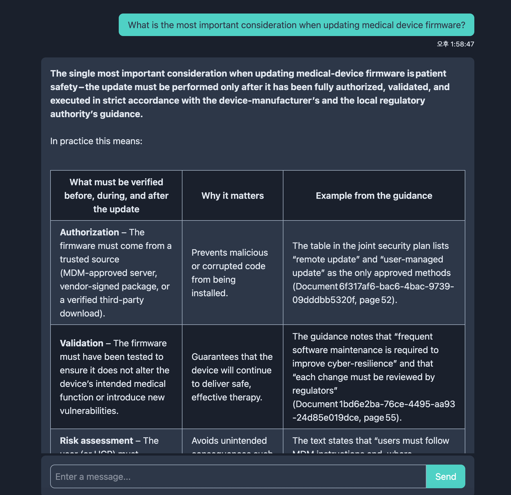

- Sources 버튼을 통해 실제로 어떤 문서가 검색되어 활용되었는지 확인할 수 있습니다.
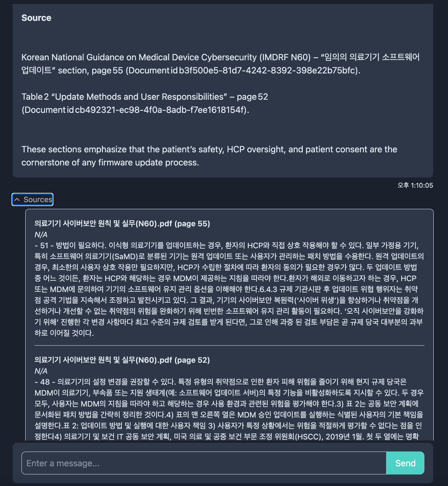

- 하지만 프롬프트(OBJECTIVE: Answer question based only on the given context...)에 정의된 대로, 관련 없는 질문에는 참고할 정보가 없다고 명확히 답변합니다.
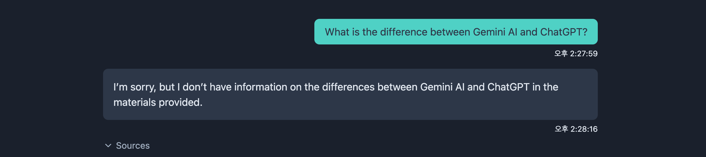

#### '기본' 템플릿 적용시

- 반면, 기본 템플릿을 적용했을 때는 동일한 질문에 정상적으로 답변하는 것을 볼 수 있습니다.
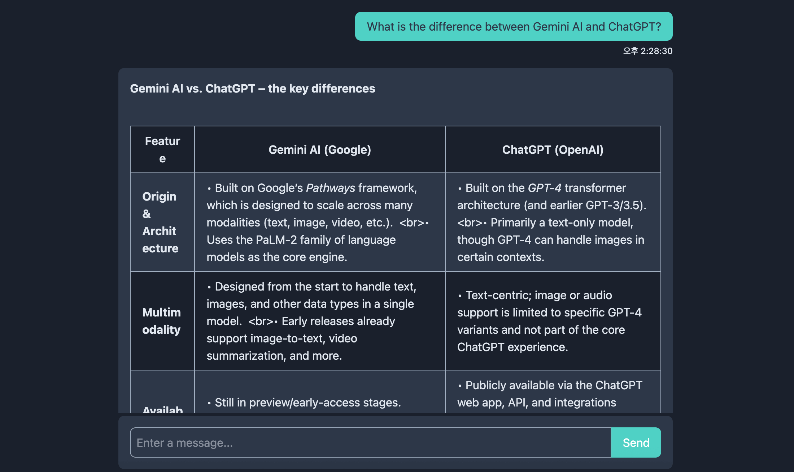
