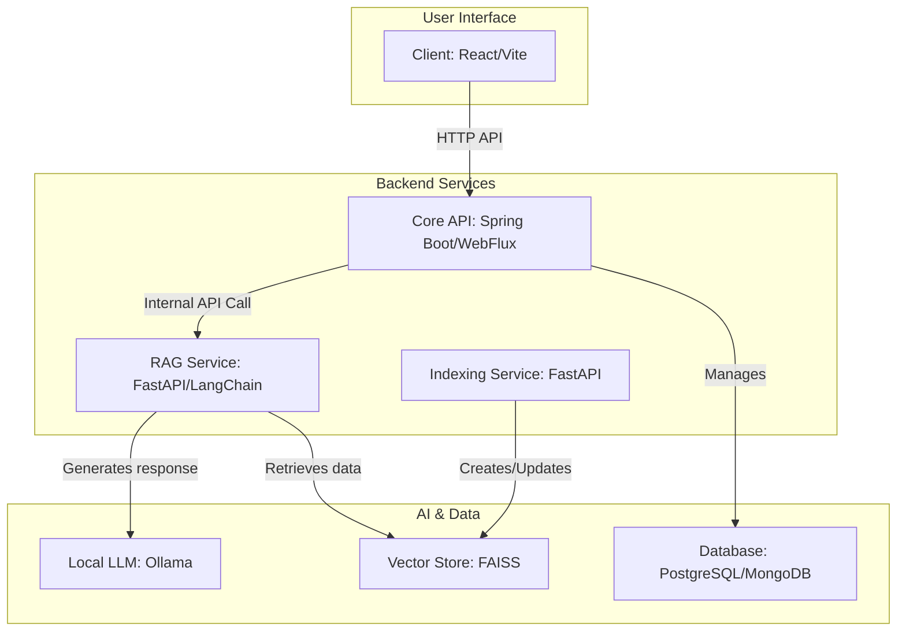

# RAG (Retrieval-Augmented Generation) Chatbot Prototype

## 1. 프로젝트 개요

이 프로젝트는 로컬 환경에서 구동 가능한 RAG(검색 증강 생성, Retrieval Augmented Generation) 기반 챗봇 프로토타입입니다. 사용자는 웹 인터페이스를 통해 질문을 입력하고, 시스템은 사전에 구축된 벡터 저장소에서 관련성 높은 문서를 검색한 후, 이 정보를 바탕으로 LLM(거대 언어 모델, Large Language Model)이 생성한 답변을 제공합니다.

전체 시스템은 MSA(Microservice Architecture) 구조를 따르며, 각 기능은 독립적인 서비스로 분리되어 유지보수와 확장이 용이하도록 설계되었습니다.

## 2. 아키텍처

모든 서비스는 독립적으로 실행되며, Client는 Core API를 통해서만 백엔드 기능에 접근합니다. Core API는 요청에 따라 내부적으로 RAG Service와 통신하여 챗봇 응답을 받아 Client에 전달하는 게이트웨이 역할을 합니다.



- **Client**: 사용자가 챗봇과 상호작용하는 웹 애플리케이션입니다. 모든 요청은 Core API를 통해 전달됩니다.
- **Core API**: 주 애플리케이션 서버. 사용자 인증, 데이터 관리 등 핵심 로직과 더불어, Client의 챗봇 요청을 RAG Service에 전달하고 응답을 받아 반환하는 게이트웨이 역할을 수행합니다.
- **RAG Service**: LLM과의 통신, 벡터 저장소 검색, 프롬프트 생성 등 RAG 파이프라인의 핵심 기능을 담당합니다.
- **Indexing Service**: (현재 기능 구현 전) 원본 데이터를 벡터로 변환하여 벡터 저장소(FAISS)를 생성하고 관리하는 역할을 합니다.
- **Local LLM**: 로컬에 설치된 Ollama를 통해 LLM 모델을 사용합니다.
- **Databases**: `core-api`에서 사용하는 PostgreSQL, MongoDB와 `rag-service`에서 사용하는 FAISS 벡터 저장소로 구성됩니다.

## 3. 기술 스택

### 3.1. Frontend (`client`)
- **Framework**: React, Vite
- **Styling**: Tailwind CSS
- **State Management**: Zustand
- **Language**: TypeScript

### 3.2. Core API (`core-api`)
- **Framework**: Spring Boot 3 (with WebFlux)
- **Language**: Java 21
- **Database**: PostgreSQL (R2DBC), MongoDB (Reactive)
- **Build Tool**: Gradle

### 3.3. RAG Service (`rag-service`)
- **Framework**: FastAPI
- **Core Logic**: LangChain
- **Vector Store**: FAISS (CPU)
- **Language**: Python

### 3.4. Indexing Service (`indexing-service`)
- **Framework**: FastAPI
- **Language**: Python

### 3.5. AI & Infrastructure
- **LLM Engine**: Ollama
- **Containerization**: Docker, Docker Compose

## 4. 디렉토리 구조

```
.
├── client/              # React 프론트엔드
├── core-api/            # Spring Boot 백엔드 API
├── indexing-service/    # 데이터 벡터화 및 인덱싱 서비스
├── rag-service/         # RAG 및 LLM 연동 서비스
├── docker-compose.yml   # 전체 서비스 Docker Compose 설정
└── README.md
```

## 5. 로컬 환경에서 실행하기 (Docker Compose)

이 프로젝트는 `docker-compose`를 통해 모든 서비스를 간편하게 실행할 수 있습니다. 단, LLM은 로컬에 설치된 Ollama를 사용해야 합니다. 만약 llm 또한 docker 컨테이너로 관리하고 싶다면 [5.1.3]()

### 5.1. 사전 준비 사항

1.  **Docker 및 Docker Compose 설치**
    - 시스템에 Docker와 Docker Compose가 설치되어 있어야 합니다.

2.  **Ollama 설치 및 모델 다운로드**
    - [Ollama 공식 홈페이지](https://ollama.com/)에서 Ollama를 다운로드하여 설치합니다.
    - 터미널에서 아래 명령어를 실행하여 사용할 LLM 모델을 다운로드합니다. (예: `gpt-oss:2b`)
      ```bash
      ollama pull gpt-oss:20b
      ```
    - **중요**: `rag-service`는 로컬의 Ollama API(`http://host.docker.internal:11434`)와 통신하도록 설정되어 있습니다.

3. **Ollama 컨테이너 사용시**
    - docker-compose.yml 파일을 수정합니다.
      ```yaml
      services:
        ...
        rag-service:
          ...
          environment:
            # 필요하다면 API 키, 모델명, 환경 변수 등
            LLM_API_BASE: "http://llm-server:11434" # <- 주석 해제
            # LLM_API_BASE: "http://host.docker.internal:11434" # <- 새롭게 주석처리
          ...
          depends_on:
            - llm-server # <- 주석 해제
          ...
        llm-server:
          build:
            context: .
            dockerfile: Dockerfile.llm-server
          restart: always
          networks:
            internal-net:
              aliases:
                - llm-server
          expose:
            - "11434"
          volumes:
            - ollama-data:/root/.ollama
        ...
      
      volumes:
        ...
        # 이하 주석해제
        ollama-data:
          driver: local
          driver_opts:
            type: none
            o: bind
            device: ${VOLUME_ROOT}/ollama/data
        ...
      ```

### 5.2. 실행 방법

1.  **환경 변수 파일 생성**
    - 프로젝트 루트 디렉토리에서 `.env.example` 파일을 복사하여 `.env` 파일을 생성합니다.
      ```bash
      cp .env.example .env
      ```
    - 필요한 경우 `.env` 파일의 내용을 자신의 환경에 맞게 수정합니다. (예: `VOLUME_ROOT`)

2.  **Docker Compose 실행**
    - 프로젝트 루트 디렉토리에서 아래 명령어를 실행하여 모든 서비스를 백그라운드에서 시작합니다.
      ```bash
      docker-compose up --build -d
      ```

3.  **서비스 접속**
    - **Frontend**: `http://localhost:5173`
    - **Core API Docs**: `http://localhost:8080/swagger-ui/index.html`

### 5.3. 서비스 종료

- 아래 명령어를 실행하여 모든 서비스를 중지하고 관련 리소스를 삭제합니다.
  ```bash
  docker-compose down
  ```
