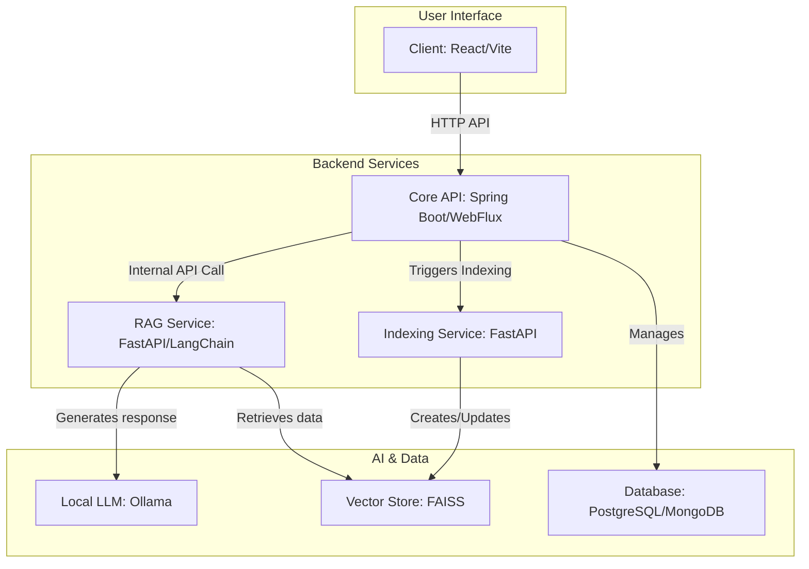

# RAG (Retrieval-Augmented Generation) Chatbot Prototype

_Read this in other languages: [Korean](README.ko.md)_

## Table of Contents
1. [Project Overview](#1-project-overview)
2. [Architecture](#2-architecture)
3. [Key Features](#3-key-features)
4. [Tech Stack](#4-tech-stack)
5. [Directory Structure](#5-directory-structure)
6. [Running Locally](#6-running-locally)

## 1. Project Overview

This project is a prototype of a Retrieval-Augmented Generation (RAG) based chatbot that can be run in a local environment. Users can input questions through a web interface, and the system retrieves relevant documents from a pre-built vector store. It then provides an answer generated by a Large Language Model (LLM) based on this information.

The entire system follows a Microservice Architecture (MSA), where each function is separated into an independent service to facilitate easy maintenance and scalability.

## 2. Architecture

All services run independently, and the Client accesses backend functionalities exclusively through the Core API. The Core API acts as a gateway, communicating internally with the RAG Service to receive chatbot responses and forwarding them to the Client.



- **Client**: A web application where users interact with the chatbot and administrators manage documents. All requests are routed through the Core API.
- **Core API**: The main application server. It handles core logic such as user authentication (JWT), Role-Based Access Control (RBAC), and document management. It also serves as a gateway, routing client requests to the appropriate internal services.
- **RAG Service**:  Manages the core functionalities of the RAG pipeline, including communication with the LLM, vector store retrieval, and prompt generation.
- **Indexing Service**: Receives requests from the Core API to convert source data into vectors and manages the creation of the vector store (FAISS).
- **Local LLM**: Utilizes an LLM model via a locally installed Ollama instance.
- **Databases**: Consists of PostgreSQL and MongoDB used by the `core-api`, and a FAISS vector store used by the `rag-service`.

## 3. Key Features

- **Real-time RAG Chatbot**: Provides answers generated by an LLM based on relevant documents retrieved in response to user questions.
- **User Authentication**: Secure login/logout functionality based on JWT.
- **Admin Dashboard**:
    - **Role-Based Access Control**: Accessible only to users with the ADMIN role.
    - **Document Management**: Allows uploading and deleting documents used for RAG.
    - **Prompt Management**: Allows administrators to create, update, and delete prompt templates used by the RAG Service.
    - **Real-time Feedback**: Enhances user experience with toast messages indicating the start and completion of document operations.
- **Responsive UI**: Implemented a dynamic sidebar navigation for user convenience.

## 4. Tech Stack

### 4.1. Frontend (`client`)
- **Framework**: React, Vite
- **Styling**: Tailwind CSS
- **State Management**: Zustand
- **Data Fetching**: React Query
- **Language**: TypeScript

### 4.2. Core API (`core-api`)
- **Framework**: Spring Boot 3 (with WebFlux)
- **Language**: Java 21
- **Authentication**: Spring Security, JWT
- **Database**: PostgreSQL (R2DBC), MongoDB (Reactive)
- **Build Tool**: Gradle

### 4.3. RAG Service (`rag-service`)
- **Framework**: FastAPI
- **Core Logic**: LangChain
- **Vector Store**: FAISS (CPU)
- **Language**: Python

### 4.4. Indexing Service (`indexing-service`)
- **Framework**: FastAPI
- **Language**: Python

### 4.5. AI & Infrastructure
- **LLM Engine**: Ollama
- **Containerization**: Docker, Docker Compose

## 5. Directory Structure

```
.
├── client/              # React Frontend
├── core-api/            # Spring Boot Backend API
├── indexing-service/    # Data vectorization and indexing service
├── rag-service/         # RAG and LLM integration service
├── docker-compose.yml   # Docker Compose settings for CPU environment
├── docker-compose.gpu.yml # Docker Compose override for GPU environment
└── README.md
```

## 6. Running Locally
This project can be easily run using `docker-compose`. You can choose to run it in either a CPU or GPU environment.

### 6.1. Common Prerequisites

1.  **Install Docker and Docker Compose**
    - Ensure Docker and Docker Compose are installed on your system.

2.  **Install Ollama and Download a Model**
    - Download and install Ollama from the[official website](https://ollama.com/).
    - Run the following command in your terminal to download an LLM model (e.g.,: `gpt-oss:2b`):
      ```bash
      ollama pull gpt-oss:20b
      ```
    - **Important**: The `rag-service` is configured by default to communicate with the local Ollama API at `http://host.docker.internal:11434`.

3. **Create Environment File**
   - In the project root directory, copy the `.env.example` file to create a `.env` file.
    ```bash
    cp .env.example .env
    ```
    - Modify the contents of the `.env` file to match your environment if necessary (e.g., `VOLUME_ROOT`).

### 6.2. How to Run (CPU Environment)
  - In the CPU environment, the `rag-service` and `indexing-service` will run on the CPU.
  - Run the following command in the project root to start all services in the background:
  ```bash
  docker compose up --build -d
  ```

### 6.3. How to Run (GPU Environment)

#### 6.3.1. GPU Prerequisites
  1. **NVIDIA GPU**: An NVIDIA GPU must be installed on your system.
  2. **NVIDIA 드라이버**: The latest NVIDIA drivers must be installed on the host machine.
  3. **NVIDIA Container Toolkit 설치**: You must install the [NVIDIA Container Toolkit](https://docs.nvidia.com/datacenter/cloud-native/container-toolkit/latest/install-guide.html) to enable Docker containers to recognize and use the GPU.

#### 6.3.2. GPU Run Command
⚠️ **Important Notice for GPU Environment**

> The provided `docker-compose.gpu.yml` and `Dockerfile.gpu` are example configurations for a GPU environment. **They have not been thoroughly tested by the author in an actual GPU environment.** You may encounter unexpected issues, and the setup may not be compatible with all GPU models or driver versions.
>
> If you run into any problems, please consider opening an **[Issues](https://github.com/fake-dev-log/rag-chatbot-prototype/issues)** on the GitHub repository with details about the problem (e.g., your GPU model, driver version, error logs). Your feedback would be greatly appreciated.

  - Run the following command from the project root. This command merges the base `docker-compose.yml` with the `docker-compose.gpu.yml` override file to configure the GPU environment.
  ```bash
  docker compose -f docker-compose.yml -f docker-compose.gpu.yml up --build -d
  ```

### 6.4. Accessing Services
  - **Frontend**: `http://localhost:5173`
  - **Core API Docs**: `http://localhost:8080/docs`

### 6.5. Stopping Services
  - Run the following command to stop all running services and remove their resources:
  ```bash
  docker compose down
  ```

### 6.6. **Using the Ollama Container (Optional)**
If you prefer to manage Ollama as a Docker container instead of using a local installation, modify your `docker-compose.yml` file as follows.
  ```yaml
  services:
    ...
    rag-service:
      ...
      environment:
        # API keys, model names, environment variables, etc. if needed
        LLM_API_BASE: "http://llm-server:11434" # <- Uncomment this line
        # LLM_API_BASE: "http://host.docker.internal:11434" # <- Comment out this line
      ...
      depends_on:
        - llm-server # <- Uncomment this line
      ...
    llm-server:
      build:
        context: .
        dockerfile: Dockerfile.llm-server
      restart: always
      networks:
        internal-net:
          aliases:
            - llm-server
      expose:
        - "11434"
      volumes:
        - ollama-data:/root/.ollama
    ...
  
  volumes:
    ...
    # Uncomment the following section
    ollama-data:
      driver: local
      driver_opts:
        type: none
        o: bind
        device: ${VOLUME_ROOT}/ollama/data
    ...
  ```